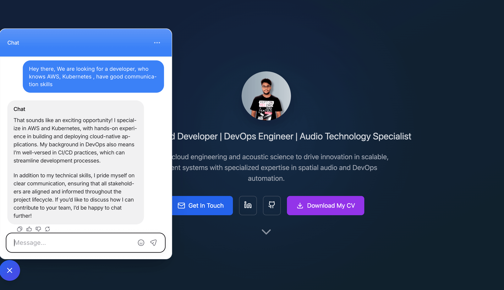
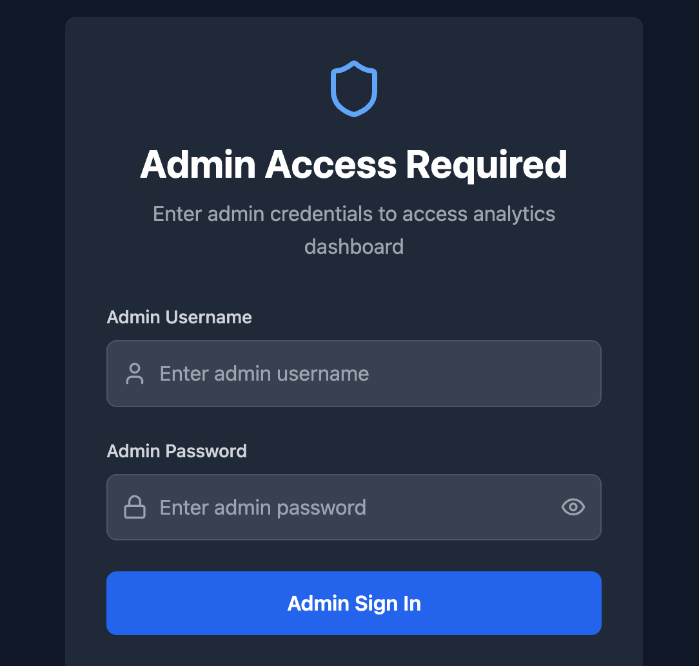

# Pranav Sharma – Portfolio, Analytics & AI Website (Development Branch)

Welcome to the cutting-edge development branch of Pranav Sharma's portfolio! This branch features the latest employer-attracting enhancements, including AI, analytics, authentication, and privacy tools, on top of a modern, professional portfolio.

## Tech Stack

- React (TypeScript)
- Vite
- Tailwind CSS
- Recharts
- Lucide-react

## Live Demo

👉 [https://myself-pranav-sharma.online/](https://myself-pranav-sharma.online/)

## 🚀 Key Features (Dev Branch)

- **AI-Powered Chatbot:** Engage with an intelligent chatbot for instant portfolio Q&A and user support.
- **Custom Analytics Dashboard:** Visualize user engagement and site metrics in real time (local analytics, privacy-first).
- **Authentication & Protected Routes:** Secure login system for accessing private/protected content.
- **Privacy Banner:** GDPR-style privacy notice for user trust and compliance.
- **Modern UI/UX:** Animated hero, responsive design, smooth navigation, and interactive cards.
- **Project & Skills Showcase:** Dynamic, filterable project cards and categorized, expandable skills section.
- **Certifications & Achievements:** Visual display of certifications with icons and dates.
- **Downloadable Resume:** One-click download for your CV.

---

## 📸 Screenshots (Dev Branch Features)

  
   <b>Modern Home Page</b>

  
   <b>AI-Powered Chatbot</b>

  
   <b>Custom Analytics Dashboard</b>

  
   <b>Authentication & Protected Routes</b>

---

## License

MIT License. See [LICENSE](./LICENSE) for details.

## Author

Pranav Sharma